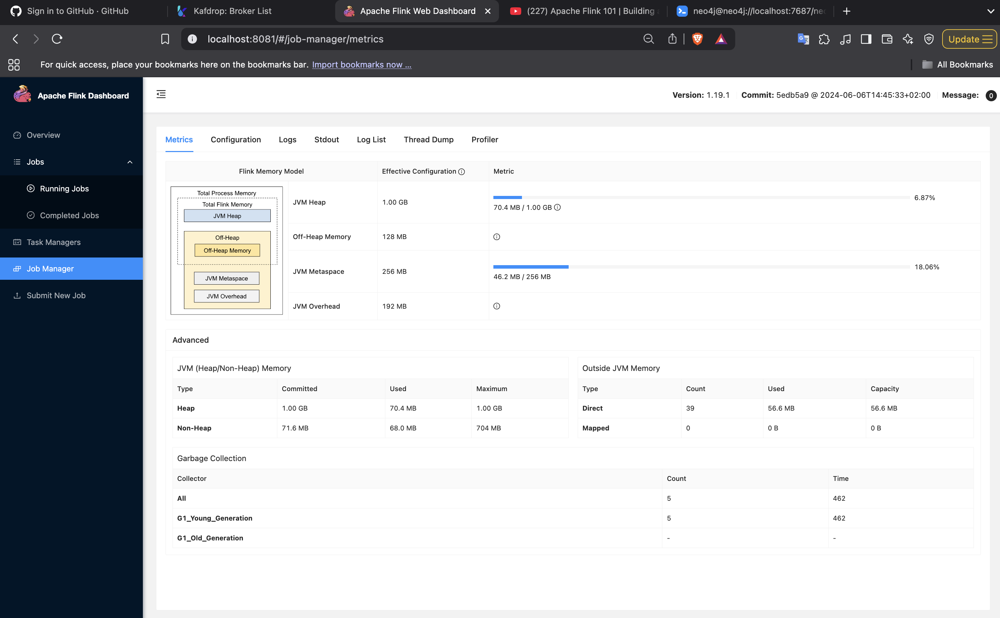
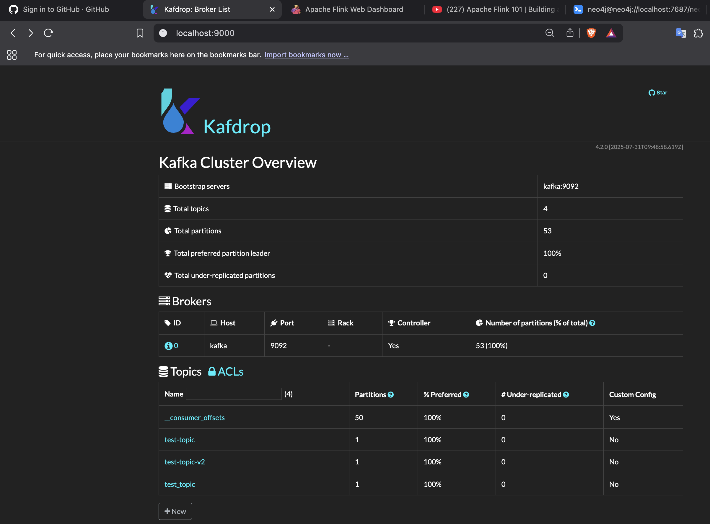
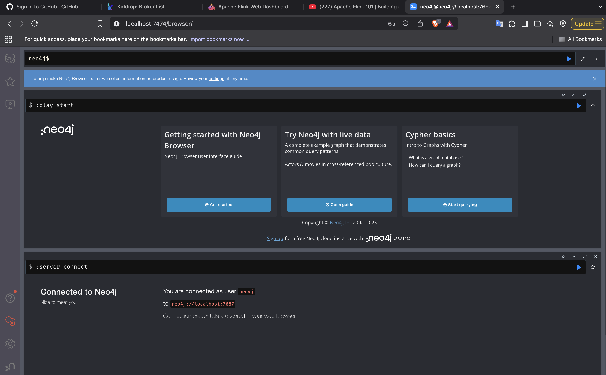

# Apache Flink Learning Lab (Java + Docker + VS Code): What, Why, and How

This repository is a hands‑on LEARNING LAB for Apache Flink using Java.

Context and goal:
- You will run a local Apache Flink “session cluster” (JobManager + TaskManager) inside Docker containers.
- You will write multiple independent Java Flink projects in VS Code on macOS.
- Each project builds a shaded (fat) JAR and you place it in a shared `jars/` folder.
- The Dockerized Flink cluster “sees” that folder, and you submit your jobs via the Web UI, CLI, or REST API.

Why this setup:
- It separates “runtime” (Flink in Docker) from “development” (your code on macOS).
- It’s quick to iterate: edit → build → copy JAR → submit → see logs.
- You can keep many small demo projects side‑by‑side (e.g., `flink-tst-modules/`, `flink-kafka-demo/`, `flink-table-sql/`) and use the same local cluster to learn.

---

## Table of Contents

1. Concept Overview (What is Flink and this lab)
2. High‑Level Architecture (Where things run)
3. Prerequisites & Installation (What you need and why)
4. Repository Layout (How files are organized)
5. Step‑by‑Step Setup (With commands and simple explanations)
6. Create Your First Project (WordCount) and Why each command/setting
7. Build the Shaded JAR (What it does under the hood)
8. Run / Submit the Job (3 Methods) and Why there are options
9. View Output (Where results go)
10. Development Loop (Edit → Build → Submit)
11. Explaining the Files & Code (docker-compose.yml, pom.xml, WordCount.java)
12. Common Errors & Fixes (What went wrong and why)
13. Adding More Projects (Scale your learning lab)
14. Cleaning Up (Stop and reset)
15. Next Learning Steps (Where to go next)
16. Quick Command Cheat Sheet


---

## 1) Concept Overview

- Apache Flink: A framework for building real-time (stream) and batch data processing jobs.
- JobManager: The “brain” that plans and coordinates your jobs.
- TaskManager: The “workers” that execute your code.
- Session Cluster: A long-running cluster that can accept many jobs over time (ideal for learning).
- Shaded JAR (fat JAR): A single JAR that bundles your code and non-Flink dependencies so the cluster can run it without hunting for libraries.

Why this matters:
- Running Flink in Docker gives you a clean, reproducible runtime.
- Building a shaded JAR ensures your job is portable and easy to submit to any Flink cluster.

---

## 2) High‑Level Architecture

```
Mac (Host)
│
├── VS Code (editing Java projects)
│
├── Docker (runs Flink services)
│   ├── Container: JobManager
│   └── Container: TaskManager (can scale to more)
│
└── Shared directory: ./jars  <-- mapped into containers at /opt/flink/usrlib
       ↑
   You copy built shaded JARs here
```

Why this layout:
- The `jars/` folder acts like a “drop zone” the cluster can see.
- You keep your source code on the host for fast editing; the cluster only needs the final JAR.

---

## 3) Prerequisites & Installation (What and Why)

| Tool | Why You Need It | Install (macOS) |
|------|------------------|-----------------|
| Homebrew (optional) | Easy package installs | https://brew.sh |
| Java 17 JDK | Compile and run Java code | `brew install openjdk@17` (Temurin also ok) |
| Maven | Build projects and create shaded JARs | `brew install maven` |
| Docker Desktop | Run Flink containers | https://www.docker.com/products/docker-desktop |
| VS Code | Editor for Java | https://code.visualstudio.com |
| VS Code Extensions | Java support + Docker tooling | Install “Extension Pack for Java”, “Docker” |
| (Optional) `tree`, `jq` | Nice-to-have tools | `brew install tree jq` |

Check versions:
```bash
java -version
mvn -version
docker version
docker compose version
```
Why:
- Confirms tools are installed and on your PATH.

If `mvn` says “command not found”:
```bash
brew install maven
```
Why we do this
- Maven is the standard tool to:
  - generate new Java project templates,
  - download libraries (Flink, logging, etc.),
  - compile your code,
  - and build a shaded (fat) JAR your Flink cluster can run.

What happens in the background
- brew install maven downloads and installs Maven.
- mvn -version verifies Maven is available on your PATH and shows the Java version in use.

How it helps
- Without Maven, you can’t easily create the project or produce the shaded jar that Flink needs.


If Homebrew path isn’t loaded (Apple Silicon):
```bash
echo 'eval "$(/opt/homebrew/bin/brew shellenv)"' >> ~/.zprofile
eval "$(/opt/homebrew/bin/brew shellenv)"
```
Why:
- Ensures your shell finds Homebrew-installed tools like `mvn`.

---

## 4) Repository Layout (Where things go and why)

After set up:
```
LEARN-apache-flink-java/
├── docker-compose.yml           # defines your local Flink cluster
├── jars/                        # all runnable shaded jars go here
├── flink-tst-modules/             # first Java project
│   ├── pom.xml
│   └── src/...
└── (more projects later) e.g. flink-kafka-demo/, flink-table-sql/, ...
```

Why:
- `docker-compose.yml` and `jars/` live at the root so Docker can mount `jars/` easily into containers.
- Each project is a self-contained Maven module you can build independently.

---

## 5) Step‑by‑Step Setup (Commands + Why)

Create base folder and enter it:
```bash
mkdir -p ~/LEARN-apache-flink-java
cd ~/LEARN-apache-flink-java
```
Why:
- Keeps all your learning files together. Using `~/LEARN-apache-flink-java` avoids path confusion.

Create `jars/` folder (shared volume):
```bash
mkdir -p jars
```
Why:
- This folder is mounted into Flink containers so they can see your JARs.

Create the Docker Compose file (defines your local Flink cluster).  
File: `docker-compose.yml`
```yaml
services:
  jobmanager:
    image: flink:1.19.1-scala_2.12-java17
    container_name: flink-jobmanager
    ports:
      - "8081:8081"
    environment:
      - |
        FLINK_PROPERTIES=
        jobmanager.rpc.address: jobmanager
        taskmanager.numberOfTaskSlots: 2
        parallelism.default: 2
    command: jobmanager
    volumes:
      - ./jars:/opt/flink/usrlib

  taskmanager:
    image: flink:1.19.1-scala_2.12-java17
    container_name: flink-taskmanager-1
    depends_on:
      - jobmanager
    environment:
      - |
        FLINK_PROPERTIES=
        jobmanager.rpc.address: jobmanager
        taskmanager.numberOfTaskSlots: 2
        parallelism.default: 2
    command: taskmanager
    volumes:
      - ./jars:/opt/flink/usrlib

networks:
  default:
    name: flink-net
```

Why we do this
- jars/ is a shared local folder where you drop built jars.
- docker-compose.yml describes two containers (JobManager and TaskManager) and maps jars/ into them.

What happens in the background
- Docker Compose:
  - pulls images if missing,
  - creates a network so containers talk to each other by name,
  - binds your local ./jars to /opt/flink/usrlib inside the containers (Flink scans this path for jars in the Web UI submit page).

How it helps
- Any jar you copy to jars/ instantly becomes visible inside both containers at /opt/flink/usrlib. That’s how you submit jobs without re-building images.

Key fields explained
- image: flink:1.19.1-scala_2.12-java17 → Flink 1.19.1 with Java 17 runtime.
- ports: "8081:8081" → exposes Flink Web UI to your browser on http://localhost:8081.
- volumes: ./jars:/opt/flink/usrlib → connects your local jars folder into the container path Flink scans.
- command: jobmanager / taskmanager → start the correct Flink processes.


Start the cluster:
```bash
docker compose up -d
```
Why:
- Launches both containers in the background (detached), creating the local cluster.

Verify:
```bash
docker compose ps
```
Why:
- Confirms both services are “Up”. If not, logs will tell you why.

Open the Flink Web UI:
- http://localhost:8081

Why:
- The dashboard is where you can submit jobs and see cluster/job status.

---

## 6) Create Your First Project (WordCount): Command + Why

Generate a starter project (run at repo root `~/LEARN-apache-flink-java`):
```bash
mvn archetype:generate \
  -DarchetypeGroupId=org.apache.flink \
  -DarchetypeArtifactId=flink-quickstart-java \
  -DarchetypeVersion=1.19.1 \
  -DgroupId=com.example \
  -DartifactId=flink-tst-modules \
  -Dversion=1.0-SNAPSHOT \
  -Dpackage=com.example \
  -DinteractiveMode=false
```

Why we do this
- Quickly create a ready-to-build Java skeleton project structured for Flink. Saves you from wiring everything by hand.

What happens in the background
- Maven contacts Maven Central (online repository), downloads the “archetype” (a project template) and expands it into a new folder named after your artifactId (flink-tst-modules).
- It creates standard folders (src/main/java, pom.xml, etc.).

How it helps
- You instantly get a consistent project structure that works with Flink and Maven.

Line-by-line explanation of the command
- mvn archetype:generate: Tells Maven to create a new project from a template (“archetype”).
- -DarchetypeGroupId=org.apache.flink: Which organization provides the template (Apache Flink).
- -DarchetypeArtifactId=flink-quickstart-java: Which template to use (Java quickstart).
- -DarchetypeVersion=1.19.1: Template version (matches the Flink version you want).
- -DgroupId=com.example: Your organization ID (part of the project’s coordinates; used in package naming).
- -DartifactId=flink-tst-modules: Your project name; also becomes the folder name.
- -Dversion=1.0-SNAPSHOT: Project version (SNAPSHOT means “in development”).
- -Dpackage=com.example: The Java package for your source code (folders under src/main/java).
- -DinteractiveMode=false: Don’t ask questions; use the values provided.


Enter the project:
```bash
cd flink-tst-modules
```
Why:
- Work inside the new project’s folder.

Replace `pom.xml` with this build recipe (sets Java 17, Flink deps, shade plugin, main class):
```xml
<?xml version="1.0" encoding="UTF-8"?>
<project xmlns="http://maven.apache.org/POM/4.0.0"
         xmlns:xsi="http://www.w3.org/2001/XMLSchema-instance"
         xsi:schemaLocation="http://maven.apache.org/POM/4.0.0 https://maven.apache.org/xsd/maven-4.0.0.xsd">
  <modelVersion>4.0.0</modelVersion>

  <groupId>com.example</groupId>
  <artifactId>flink-tst-modules</artifactId>
  <version>1.0-SNAPSHOT</version>
  <name>flink-tst-modules</name>

  <properties>
    <project.build.sourceEncoding>UTF-8</project.build.sourceEncoding>
    <maven.compiler.source>17</maven.compiler.source>
    <maven.compiler.target>17</maven.compiler.target>
    <flink.version>1.19.1</flink.version>
    <execution.mainClass>com.example.WordCount</execution.mainClass>
  </properties>

  <dependencies>
    <dependency>
      <groupId>org.apache.flink</groupId>
      <artifactId>flink-java</artifactId>
      <version>${flink.version}</version>
      <scope>provided</scope>
    </dependency>
    <dependency>
      <groupId>org.apache.flink</groupId>
      <artifactId>flink-streaming-java</artifactId>
      <version>${flink.version}</version>
      <scope>provided</scope>
    </dependency>
    <dependency>
      <groupId>org.slf4j</groupId>
      <artifactId>slf4j-log4j12</artifactId>
      <version>1.7.36</version>
      <scope>runtime</scope>
    </dependency>
  </dependencies>

  <build>
    <plugins>
      <plugin>
        <groupId>org.apache.maven.plugins</groupId>
        <artifactId>maven-shade-plugin</artifactId>
        <version>3.5.1</version>
        <executions>
          <execution>
            <phase>package</phase>
            <goals><goal>shade</goal></goals>
            <configuration>
              <createDependencyReducedPom>false</createDependencyReducedPom>
              <finalName>${project.artifactId}-assembly</finalName>
              <transformers>
                <transformer implementation="org.apache.maven.plugins.shade.resource.ManifestResourceTransformer">
                  <mainClass>${execution.mainClass}</mainClass>
                </transformer>
              </transformers>
            </configuration>
          </execution>
        </executions>
      </plugin>

      <plugin>
        <groupId>org.apache.maven.plugins</groupId>
        <artifactId>maven-compiler-plugin</artifactId>
        <version>3.11.0</version>
        <configuration>
          <source>${maven.compiler.source}</source>
          <target>${maven.compiler.target}</target>
        </configuration>
      </plugin>
    </plugins>
  </build>
</project>
```

You opened and replaced flink-tst-modules/pom.xml with a version that:
- sets Java 17,
- adds Flink dependencies as “provided”,
- and configures the Maven Shade Plugin to produce a fat jar named flink-tst-modules-assembly.jar,
- sets the main class (com.example.WordCount).

Why we do this
- Default quickstart pom is fine, but the Shade plugin config ensures we get one runnable jar with your code and non-Flink dependencies.
- “provided” scope means the Flink runtime libraries come from the Docker image, not your jar (avoids version conflicts and big jars).

What happens in the background
- When you later run mvn package, Maven:
  - downloads dependencies,
  - compiles your code,
  - then Shade plugin merges classes/resources into a single jar with the main class written into the manifest.

How it helps
- The Flink cluster expects a runnable jar. Shading makes it portable and easier to submit.

Tip: Java version mismatch
- We use Docker images with Java 17 runtime (image tag ends with -java17).
- If you choose a Java 11 image, you must set the pom compiler target to 11 to avoid UnsupportedClassVersionError.


Create the main class `src/main/java/com/example/WordCount.java`:
```java
package com.example;

import org.apache.flink.api.common.functions.FlatMapFunction;
import org.apache.flink.api.common.restartstrategy.RestartStrategies;
import org.apache.flink.api.common.time.Time;
import org.apache.flink.api.java.tuple.Tuple2;
import org.apache.flink.streaming.api.environment.StreamExecutionEnvironment;
import org.apache.flink.util.Collector;

public class WordCount {
    public static void main(String[] args) throws Exception {
        StreamExecutionEnvironment env = StreamExecutionEnvironment.getExecutionEnvironment();

        env.getConfig().setRestartStrategy(RestartStrategies.fixedDelayRestart(
                3, Time.seconds(10)
        ));

        env.fromElements(
                "hello world",
                "hello flink",
                "flink loves streams",
                "hello docker"
        )
        .flatMap(new Tokenizer())
        .keyBy(value -> value.f0)
        .sum(1)
        .print();

        env.execute("Streaming WordCount Example");
    }

    public static final class Tokenizer implements FlatMapFunction<String, Tuple2<String,Integer>> {
        @Override
        public void flatMap(String value, Collector<Tuple2<String, Integer>> out) {
            for (String token : value.toLowerCase().split("\\W+")) {
                if (!token.isEmpty()) {
                    out.collect(Tuple2.of(token, 1));
                }
            }
        }
    }
}
```
Why this code:
- A minimal streaming pipeline:
  - Creates an environment.
  - Reads a small in-memory list of lines.
  - Splits into words and maps each word to (word, 1).
  - Groups by the word and sums counts.
  - Prints results to stdout (TaskManager logs).
- The restart strategy is illustrative (how a real job might be configured).

Go back to repo root:
```bash
cd ..
```
Why:
- You’ll build and manage containers from the repository root.

---

## 7) Build the Shaded JAR (What happens under the hood)

Build and copy:
```bash
cd flink-tst-modules
mvn clean package -DskipTests
cd ..
cp flink-tst-modules/target/flink-tst-modules-assembly.jar jars/
ls -l jars/
```
Why
- `mvn clean package` compiles your code and runs the Shade plugin to produce one runnable JAR.
- Copying it into `jars/` makes it visible to the containers at `/opt/flink/usrlib`.
- `ls -l jars/` confirms the JAR is actually in the shared folder.
- “Compile and package” your code into a single runnable jar, then place it where the containers can see it.

What happens in the background
- mvn clean removes previous build outputs.
- mvn package:
  - compiles Java,
  - resolves dependencies from Maven Central,
  - the Shade plugin creates flink-tst-modules-assembly.jar with your main class in the manifest.
- cp … ../jars/ → copies the jar into the shared folder mounted inside containers.

How it helps
- Once the jar is in jars/, it appears inside containers at /opt/flink/usrlib.

Tip
- Each time you change code, repeat “mvn package” and copy the resulting jar into jars/.


Behind the scenes:
- Maven downloads dependencies from Maven Central (first time).
- Shade merges your classes and non-provided dependencies and adds the Main-Class entry so Flink can detect `com.example.WordCount`.

---

## 8) Run / Submit the Job (Why multiple methods)

Method A — Web UI (easiest to see what’s happening):
1) http://localhost:8081 → Submit new job  
2) Pick `flink-tst-modules-assembly.jar` (Flink scans `/opt/flink/usrlib`)  
3) Main class = `com.example.WordCount` (autodetected)  
4) Submit

Why:
- Visual, simple, and good for learning.

Method B — CLI inside JobManager (scriptable):
```bash
docker compose exec jobmanager /opt/flink/bin/flink run /opt/flink/usrlib/flink-tst-modules-assembly.jar
```
Why:
- Useful in automation or when working entirely from terminal.

Method C — REST API (advanced/CI):
```bash
curl -F "jarfile=@flink-tst-modules/target/flink-tst-modules-assembly.jar" http://localhost:8081/jars/upload
# Response shows ..."filename":"/.../jars/<id>"
curl -X POST http://localhost:8081/jars/<id>/run
```
Why:
- Lets you integrate submissions into scripts and CI/CD without logging into the container or UI.

What happens on submit:
- JobManager loads your jar, builds a JobGraph, schedules tasks on TaskManagers, and starts executing. Your `print()` sink writes to TaskManager logs.

---

## 9) View Output (Where to look and why)

Follow TaskManager logs:
```bash
docker logs -f flink-taskmanager-1
```
Why:
- The `.print()` operator writes to stdout of the TaskManager process.
- `-f` follows the log stream so you can watch output live.

Expected sample lines:
```
(hello,3)
(flink,2)
(world,1)
(loves,1)
(streams,1)
(docker,1)
```

Stop following:
- Press Ctrl+C (containers keep running).

---

## 10) Development Loop (Why rebuild every time)

After changing code:
```bash
cd flink-tst-modules
mvn -q package -DskipTests
cp target/flink-tst-modules-assembly.jar ../jars/
cd ..
# Re-submit via UI, CLI, or REST
```
Why:
- Flink runs compiled jars, not source. Rebuilding packages your latest code into the JAR you submit.

Optional VS Code task to automate:
```json
{
  "version": "2.0.0",
  "tasks": [
    {
      "label": "Build Flink Jar",
      "type": "shell",
      "command": "mvn clean package -DskipTests && cp target/flink-tst-modules-assembly.jar ../jars/",
      "options": { "cwd": "${workspaceFolder}/flink-tst-modules" }
    }
  ]
}
```
Why:
- One-click build+copy from VS Code to speed up your iteration cycle.

---

## 11) Explaining the Files & Code (Plain-English)

docker-compose.yml — key lines explained:
- `image: flink:1.19.1-scala_2.12-java17`: Use Flink runtime with Java 17 so it matches your compiled code.
- `ports: "8081:8081"`: Show Flink Web UI on your Mac’s port 8081.
- `volumes: ./jars:/opt/flink/usrlib`: Share your local `jars/` into the container at the path the UI scans for jars.
- `command: jobmanager` / `command: taskmanager`: Start the right Flink processes within each container.
- `taskmanager.numberOfTaskSlots: 2` and `parallelism.default: 2`: Basic parallelism settings for learning; change as needed.

pom.xml — why certain settings:
- `<scope>provided</scope>`: Flink libraries come from the container; don’t bundle them into your jar (prevents version conflicts and bloat).
- `maven-shade-plugin`: Creates a single runnable JAR for Flink to execute.
- `<finalName>${project.artifactId}-assembly</finalName>`: Predictable output filename like `flink-tst-modules-assembly.jar`.
- `<execution.mainClass>` + manifest transformer: Makes the main class discoverable automatically by Flink.

WordCount.java — what it does:
- Creates a stream environment.
- Reads a few demo strings into a stream.
- Tokenizes into words and maps to pairs `(word, 1)`.
- Groups by `word` and sums counts.
- Prints the results to logs.
- Calls `env.execute(...)` to start the job in the cluster.

Why a shaded JAR:
- Ensures your job has everything it needs (except the Flink runtime itself which is provided by the container). No missing-class surprises on the cluster.

---

## 12) Common Errors & Fixes (Cause and Why)

- `zsh: command not found: mvn`  
  Why: Maven not installed or PATH not set.  
  Fix: `brew install maven`, ensure brew shellenv is loaded.

- `JAR file does not exist: /opt/flink/usrlib/...`  
  Why: Container doesn’t see your JAR (wrong folder, wrong working dir for `docker compose up`, or jar not copied).  
  Fix: Copy the jar to `./jars` and ensure you run Docker commands from the folder that contains `docker-compose.yml`.  
  Check inside container:  
  ```bash
  docker compose exec jobmanager ls -l /opt/flink/usrlib
  ```

- `UnsupportedClassVersionError ... compiled by a more recent version`  
  Why: Jar compiled with Java 17 but container running Java 11 (or vice versa).  
  Fix: Use `flink:...-java17` image (recommended), or set Maven compiler target to 11.

- `Unknown module: jdk.compiler` warnings  
  Why: Harmless JRE module flags; can be ignored.

- Port 8081 busy  
  Why: Another process is using it.  
  Fix: Change mapping to `"8082:8081"` then open http://localhost:8082.

- `ClassNotFoundException` for your main class  
  Why: Wrong jar (not shaded) or missing manifest main class.  
  Fix: Use the `-assembly.jar` built by Shade and ensure `<execution.mainClass>` matches your class.

Diagnostics you can run:
```bash
docker compose exec jobmanager ls -l /opt/flink/usrlib
docker compose exec jobmanager java -version
docker compose logs jobmanager
docker compose logs taskmanager
```

---

## 13) Adding More Projects (Scaling your lab)

Example: add a Kafka demo project.
```bash
cd ~/LEARN-apache-flink-java
mvn archetype:generate -DarchetypeGroupId=org.apache.flink \
  -DarchetypeArtifactId=flink-quickstart-java \
  -DarchetypeVersion=1.19.1 \
  -DgroupId=com.example \
  -DartifactId=flink-kafka-demo \
  -Dversion=1.0-SNAPSHOT \
  -Dpackage=com.example.kafka \
  -DinteractiveMode=false
```
Why:
- You can create many independent projects. Build each, copy its `-assembly.jar` to `jars/`, and choose which to run from the Web UI.

---

## 14) Cleaning Up (When you’re done)

Stop containers:
```bash
docker compose down
```
Why:
- Stops and removes containers and the network.

Remove containers + network + anonymous volumes:
```bash
docker compose down -v
```
Why:
- Cleans up any leftover anonymous volumes for a fresh start next time.

Remove built jars:
```bash
rm -f jars/*.jar
```
Why:
- Clears old artifacts if you want a clean `jars/` folder.

---

## 15) Next Learning Steps (Ideas)

- Add a Socket source (e.g., `nc -lk 9000`) and stream live text.
- Integrate Kafka (add `flink-connector-kafka`, start Kafka via Docker).
- Explore Table API / SQL (add SQL dependencies, try the SQL client).
- Enable checkpointing and state backends (e.g., RocksDB) for fault tolerance.
- Play with event time and watermarks.
- Add metrics via Prometheus + Grafana.
- Try Application Mode (Flink container starts directly with your job jar).
- Deploy to a remote cluster (Kubernetes, standalone remote, etc.).

Ask and we can extend this lab with templates for each topic.

---

## 16) Quick Command Cheat Sheet

| Task | Command |
|------|---------|
| Start cluster | `docker compose up -d` |
| Stop cluster | `docker compose down` |
| Build project | `mvn clean package -DskipTests` |
| Copy jar | `cp flink-tst-modules/target/flink-tst-modules-assembly.jar jars/` |
| List jars in container | `docker compose exec jobmanager ls -l /opt/flink/usrlib` |
| Submit (CLI) | `docker compose exec jobmanager /opt/flink/bin/flink run /opt/flink/usrlib/<jar>` |
| View TaskManager logs | `docker logs -f flink-taskmanager-1` |
| Scale TaskManagers | `docker compose up -d --scale taskmanager=3` |
| Upload via REST | `curl -F "jarfile=@path/to.jar" http://localhost:8081/jars/upload` |
| Run uploaded jar | `curl -X POST http://localhost:8081/jars/<id>/run` |

Why this cheat sheet:
- These are your most-used commands in daily learning and troubleshooting.

---

## 17) FAQ (Short, practical answers)

- Can I keep multiple versions of the same project jar?  
  Yes. Rename them on copy, e.g. `flink-tst-modules-v2.jar`, and choose in the Web UI.

- Why not include Flink libraries inside my jar?  
  The container already provides them. Bundling risks version conflicts and larger jars.

- Where are results written?  
  For `.print()`, to TaskManager stdout logs (`docker logs -f flink-taskmanager-1`). Real jobs typically write to Kafka, files, or databases.

- Apple Silicon (M1/M2/M3) considerations?  
  The official Flink images are multi‑arch. If you hit oddities, ensure Docker Desktop is up-to-date, or add a platform override. Using the `-java17` image aligns runtime with your compiled code.

---

# Add Kafka, Redis, and Neo4j to your Flink Docker Lab (End-to-End)

Goal:
- Run Kafka, Redis, and Neo4j alongside your existing Flink cluster in Docker.
- Produce events into Kafka and (later, via a Flink job) write results to Redis and Neo4j.
- Clear, step-by-step instructions with simple explanations of what/why/how.

What you will get:
- A single docker-compose.yml that starts: Flink (JobManager + TaskManager), Kafka (KRaft mode, no ZooKeeper), Redis, and Neo4j.
- Host and container ports wired for both “inside Docker” and “from your Mac” usage.
- Test commands to verify Kafka, Redis, and Neo4j before you write Flink jobs.

Note on names and networking:
- Inside Docker, services reach each other by service name on the default network (e.g., “kafka”, “redis”, “neo4j”).
- Your Flink jobs running in containers should use those service names, not localhost.
- From your Mac (host), you use localhost and the mapped ports we expose.

---

## 1) Update your docker-compose.yml (Full file)

Replace your current file with this one. It keeps your existing Flink cluster and adds Kafka, Redis, and Neo4j. It also uses a Kafka image configured for both internal (Docker network) and external (your Mac) clients.

```yaml name=docker-compose.yml
services:
  jobmanager:
    image: flink:1.19.1-scala_2.12-java17
    container_name: flink-jobmanager
    ports:
      - "8081:8081"   # Flink Web UI (host -> container)
    environment:
      - |
        FLINK_PROPERTIES=
        jobmanager.rpc.address: jobmanager
        taskmanager.numberOfTaskSlots: 2
        parallelism.default: 2
    command: jobmanager
    volumes:
      - ./jars:/opt/flink/usrlib

  taskmanager:
    image: flink:1.19.1-scala_2.12-java17
    container_name: flink-taskmanager-1
    depends_on:
      - jobmanager
    environment:
      - |
        FLINK_PROPERTIES=
        jobmanager.rpc.address: jobmanager
        taskmanager.numberOfTaskSlots: 2
        parallelism.default: 2
    command: taskmanager
    volumes:
      - ./jars:/opt/flink/usrlib

  # Kafka in KRaft (no ZooKeeper), with internal and external listeners.
  kafka:
    image: bitnami/kafka:3.7
    container_name: kafka
    ports:
      - "9094:9094"   # external client access from your Mac (localhost:9094)
    environment:
      - KAFKA_ENABLE_KRAFT=yes
      - KAFKA_CFG_PROCESS_ROLES=broker,controller
      - KAFKA_CFG_NODE_ID=1
      - KAFKA_CFG_CONTROLLER_QUORUM_VOTERS=1@kafka:9093
      - KAFKA_CFG_CONTROLLER_LISTENER_NAMES=CONTROLLER
      # Listeners: internal broker :9092, controller :9093, host-mapped :9094
      - KAFKA_CFG_LISTENERS=PLAINTEXT://:9092,CONTROLLER://:9093,PLAINTEXT_HOST://:9094
      # Inside Docker other services use kafka:9092; from Mac use localhost:9094
      - KAFKA_CFG_ADVERTISED_LISTENERS=PLAINTEXT://kafka:9092,PLAINTEXT_HOST://localhost:9094
      - KAFKA_CFG_LISTENER_SECURITY_PROTOCOL_MAP=CONTROLLER:PLAINTEXT,PLAINTEXT:PLAINTEXT,PLAINTEXT_HOST:PLAINTEXT
      - KAFKA_CFG_INTER_BROKER_LISTENER_NAME=PLAINTEXT
      # For quick demos (Kafka will create topics automatically when first used)
      - KAFKA_CFG_AUTO_CREATE_TOPICS_ENABLE=true
      # Storage path
      - KAFKA_LOG_DIRS=/bitnami/kafka/data
    volumes:
      - kafka_data:/bitnami/kafka
    # Kafka will start fine without Flink, but everything shares the default network
    depends_on:
      - jobmanager

  # Redis cache
  redis:
    image: redis:7-alpine
    container_name: redis
    ports:
      - "6379:6379"  # Redis from host: localhost:6379
    command: ["redis-server", "--appendonly", "yes"]
    volumes:
      - redis_data:/data

  # Neo4j graph database (Community edition)
  neo4j:
    image: neo4j:5.22-community
    container_name: neo4j
    ports:
      - "7474:7474"  # HTTP UI (browser)
      - "7687:7687"  # Bolt (drivers)
    environment:
      # Change this password to something you like
      - NEO4J_AUTH=neo4j/neo4j123
      # Modest memory settings for laptops; adjust as needed
      - NEO4J_server_memory_pagecache_size=512M
      - NEO4J_server_memory_heap_initial__size=512M
      - NEO4J_server_memory_heap_max__size=512M
    volumes:
      - neo4j_data:/data
      - neo4j_logs:/logs

networks:
  default:
    name: flink-net

volumes:
  kafka_data:
  redis_data:
  neo4j_data:
  neo4j_logs:
```

What this file does (in easy words):
- Flink stays the same (JobManager + TaskManager).
- Kafka runs in “KRaft” mode (modern Kafka without ZooKeeper), using:
  - Internal listener for Docker services: kafka:9092
  - External listener so your Mac tools can reach it: localhost:9094
- Redis exposes port 6379 to your Mac.
- Neo4j exposes 7474 (web UI) and 7687 (Bolt driver) to your Mac.
- Named volumes (kafka_data, redis_data, neo4j_data, neo4j_logs) persist data between restarts.

Why two Kafka listeners?
- Your Flink containers talk to Kafka via the Docker network using “kafka:9092”.
- You (on macOS) can use tools on “localhost:9094”.
- This avoids “it works inside Docker but not from my laptop” problems.

Apple Silicon note:
- Bitnami/Redis/Neo4j images are multi-arch and work on M1/M2/M3.

---

## 2) Start everything

```bash
docker compose up -d
```

Why:
- Starts all containers in the background (detached). On the first run, Docker pulls the images.

Check status:
```bash
docker compose ps
```

Why:
- Confirms services are “Up”. If something is “Exited”, read its logs:
```bash
docker compose logs kafka
docker compose logs redis
docker compose logs neo4j
```

---

## 3) Quick tests that everything works

These tests do not require any Java code yet. They verify your Docker services are healthy.

### 3.1 Kafka: create a topic, produce and consume

Create a topic (inside the Kafka container):
```bash
docker compose exec kafka /opt/bitnami/kafka/bin/kafka-topics.sh \
  --bootstrap-server kafka:9092 \
  --create --topic test-events --partitions 1 --replication-factor 1
```
Why:
- Creates a topic named “test-events” where we’ll write/read messages.
- Uses the internal address kafka:9092 (service name on Docker network).

List topics:
```bash
docker compose exec kafka /opt/bitnami/kafka/bin/kafka-topics.sh \
  --bootstrap-server kafka:9092 --list
```

Start a consumer to watch messages:
```bash
docker compose exec kafka /opt/bitnami/kafka/bin/kafka-console-consumer.sh \
  --bootstrap-server kafka:9092 \
  --topic test-events \
  --from-beginning
```
Why:
- This terminal will print any messages on “test-events”.

Open another terminal and start a producer:
```bash
docker compose exec kafka /opt/bitnami/kafka/bin/kafka-console-producer.sh \
  --bootstrap-server kafka:9092 \
  --topic test-events
```
Type a few lines, press Enter after each. You should see them show up in the consumer window.

From your Mac (host) using the external port:
- If you have a local Kafka client (e.g., kcat), you can connect with `-b localhost:9094`.

### 3.2 Redis: simple ping and set/get
```bash
docker compose exec redis redis-cli ping
docker compose exec redis redis-cli set demo "hello-redis"
docker compose exec redis redis-cli get demo
```
Why:
- Verifies Redis is reachable and can store/read a key.

### 3.3 Neo4j: open the browser UI
- Go to http://localhost:7474
- Log in with user: neo4j, password: neo4j123 (change in compose for real use)
- Optional: Try a simple Cypher in the UI:
  ```
  CREATE (:Person {name: "Alice"})
  MATCH (n:Person) RETURN n LIMIT 5;
  ```

---

## 4) How your Flink job will connect to services

Inside Docker (from Flink containers), use service names:
- Kafka bootstrap servers: kafka:9092
- Redis host/port: redis:6379
- Neo4j Bolt URI: bolt://neo4j:7687 (user neo4j, password from compose)

From your Mac (host), use:
- Kafka: localhost:9094
- Redis: localhost:6379
- Neo4j Browser: http://localhost:7474, Bolt: bolt://localhost:7687

Why different addresses?
- “kafka”, “redis”, “neo4j” are DNS names only visible inside the Docker network. Your Mac needs mapped ports on localhost.


# Dashboard Screenshots

### Flink Dashboard


### Kafka UI


### Neo4j Dashboard


---

## 5) Sample snippets (what it looks like in code)

These are short examples to show how to reference connection settings in a Flink job. You’ll integrate them into your own project code.

### 5.1 Flink Kafka Source (read strings)

```java
// Add the Kafka connector dependency in your pom (version aligned with Flink 1.19).
// Example (check Flink docs for the latest 1.19-compatible version):
// <dependency>
//   <groupId>org.apache.flink</groupId>
//   <artifactId>flink-connector-kafka</artifactId>
//   <version>3.2.0-1.19</version>
// </dependency>

import org.apache.flink.api.common.eventtime.WatermarkStrategy;
import org.apache.flink.api.common.serialization.SimpleStringSchema;
import org.apache.flink.connector.kafka.source.KafkaSource;

KafkaSource<String> source = KafkaSource.<String>builder()
    .setBootstrapServers("kafka:9092")       // internal Docker address
    .setTopics("test-events")
    .setGroupId("demo-group")
    .setValueOnlyDeserializer(new SimpleStringSchema())
    .build();

// env is your StreamExecutionEnvironment
env.fromSource(source, WatermarkStrategy.noWatermarks(), "kafka-source");
```

Explanation:
- Points the Kafka client at kafka:9092 (works inside Docker).
- Reads text messages from topic “test-events”.
- Uses a simple string deserializer.

### 5.2 Writing to Redis from Flink (simple example)

```java
// Add a Redis client like Jedis to your pom:
// <dependency>
//   <groupId>redis.clients</groupId>
//   <artifactId>jedis</artifactId>
//   <version>5.1.3</version>
// </dependency>

import org.apache.flink.streaming.api.functions.sink.RichSinkFunction;
import redis.clients.jedis.Jedis;

public class RedisSink extends RichSinkFunction<String> {
  private transient Jedis jedis;

  @Override
  public void open(org.apache.flink.configuration.Configuration parameters) {
    jedis = new Jedis("redis", 6379); // redis is the service name
  }

  @Override
  public void invoke(String value, Context context) {
    // simplistic example: push each line to a list
    jedis.lpush("events", value);
  }

  @Override
  public void close() {
    if (jedis != null) jedis.close();
  }
}

// Usage:
// someDataStream.addSink(new RedisSink());
```

Explanation:
- Uses the Redis Docker service name “redis” and default port 6379.
- Pushes each processed record to a Redis list named “events”.

### 5.3 Writing to Neo4j from Flink (simple example)

```java
// Neo4j Java Driver dependency:
// <dependency>
//   <groupId>org.neo4j.driver</groupId>
//   <artifactId>neo4j-java-driver</artifactId>
//   <version>5.21.0</version>
// </dependency>

import org.apache.flink.streaming.api.functions.sink.RichSinkFunction;
import org.neo4j.driver.*;

public class Neo4jSink extends RichSinkFunction<String> {
  private transient Driver driver;

  @Override
  public void open(org.apache.flink.configuration.Configuration parameters) {
    driver = GraphDatabase.driver(
      "bolt://neo4j:7687",  // service name in Docker
      AuthTokens.basic("neo4j", "neo4j123")  // match your compose env
    );
  }

  @Override
  public void invoke(String value, Context context) {
    try (Session session = driver.session()) {
      session.executeWrite(tx -> {
        // Very simple example: create a node for each value
        tx.run("MERGE (:Event {payload: $p})", Values.parameters("p", value));
        return null;
      });
    }
  }

  @Override
  public void close() {
    if (driver != null) driver.close();
  }
}

// Usage:
// someDataStream.addSink(new Neo4jSink());
```

Explanation:
- Connects to Neo4j over Bolt using the Docker service name “neo4j”.
- Writes each record as a node (MERGE ensures idempotent insert per payload).

Note:
- Adjust schemas, indexes, and transaction batching for real workloads.

---

## 6) Typical end-to-end flow (for your learning pipeline)

1) Start all services:
```bash
docker compose up -d
```
2) Verify Kafka, Redis, Neo4j quickly with the tests in section 3.
3) Build your Flink job jar and copy it to ./jars:
```bash
mvn -q -f flink-tst-modules/pom.xml clean package -DskipTests
cp flink-tst-modules/target/flink-tst-modules-assembly.jar jars/
```
4) Submit the job (Web UI or CLI), and in your job use:
- Kafka bootstrap servers: kafka:9092
- Redis host: redis, port 6379
- Neo4j URI: bolt://neo4j:7687

5) Watch TaskManager logs for your job’s output:
```bash
docker logs -f flink-taskmanager-1
```

---

## 7) Troubleshooting (quick causes and fixes)

- Kafka topic not found / connection refused:
  - Make sure Kafka is “Up”: `docker compose ps`
  - Use the right address (inside Docker: kafka:9092; from Mac: localhost:9094)
  - Check logs: `docker compose logs kafka`

- Host client cannot connect to Kafka:
  - Use `localhost:9094` (not 9092). 9092 is internal to Docker.
  - The advertised listeners must include `PLAINTEXT_HOST://localhost:9094` (already set in compose).

- Redis/Neo4j auth or connection issues:
  - Redis has no password by default here. Neo4j uses NEO4J_AUTH from compose; verify credentials.
  - Confirm ports are exposed: Redis 6379, Neo4j 7474/7687.

- Flink job can’t resolve hostnames:
  - Ensure your job uses service names (kafka, redis, neo4j) and runs inside Docker (Flink cluster).
  - All services share the `flink-net` network by default.

- Apple Silicon quirks:
  - Ensure Docker Desktop is up to date.
  - Bitnami/Redis/Neo4j images are multi-arch; if an image fails, try pulling the latest tag or check image docs.

---

If you want, I can:
- Add a minimal Flink job template that reads Kafka and writes to Redis/Neo4j.
- Add a VS Code task or Makefile to build and submit in one command.
- Add a Kafka UI (e.g., Redpanda Console) to browse topics/messages.